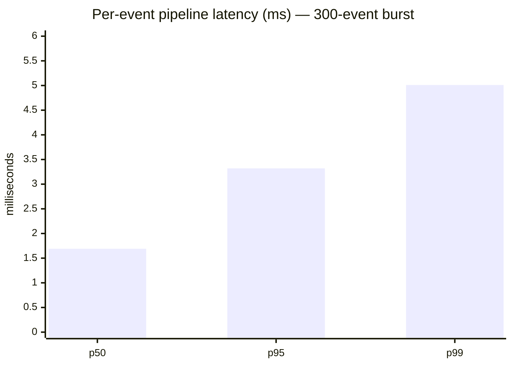
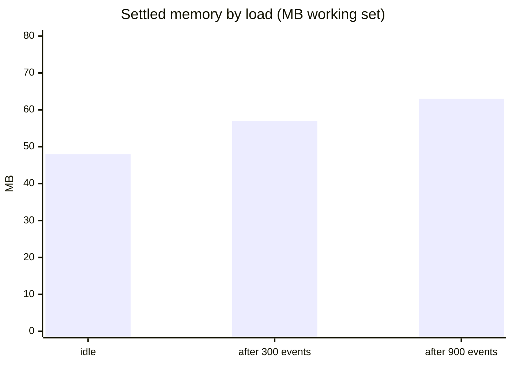

# Elite Streambot

**A real-time bridge between Elite Dangerous and Streamer.bot.** Watches the game's journal as you play and fires Streamer.bot actions when things happen in the black — bounties, interdictions, deaths, first discoveries, rank-ups, low fuel, anything the journal records — driven by a flexible rules engine with a no-code visual builder.

```
┌─────────────────┐      ┌──────────────────────┐      ┌──────────────┐      ┌─────────────────┐
│ Elite Dangerous │ ───► │    Elite Streambot   │ ───► │ Streamer.bot │ ───► │ sounds · TTS ·  │
│ journal files   │      │  rules + templates   │  WS  │ your actions │      │ OBS · chat · …  │
└─────────────────┘      └──────────────────────┘      └──────────────┘      └─────────────────┘
```

Built for streamers: set it up once, leave it running, and your alerts react to the game with the live data (reward amounts, system names, killer names, session totals) baked in.

## Features

- **Live journal watcher** — tails the active journal reliably (polling, survives file rotation mid-session) and replays the newest log on startup so restarting the app never resets your session totals. Replayed events never re-fire alerts.
- **Status.json flag events** — synthetic triggers for state transitions the journal doesn't log: `Status.LowFuel`, `Status.Overheating`, `Status.InDanger`, `Status.BeingInterdicted`, `Status.ShieldsDown`, `Status.ShieldsRestored`.
- **Rules engine** — YAML rules with **sandboxed** conditions (no arbitrary code from shared rule files), per-rule cooldowns, and `{{templated | args}}`; hot-reloads on file save.
- **Visual rule builder** — build or edit rules entirely in the dashboard: type-ahead event names, friendly condition rows with field suggestions taken from your own journal history, Streamer.bot action auto-complete, a plain-English readback, and a YAML preview. Builder and hand-edited files are interchangeable.
- **Session stats** — running totals (jumps, distance, credits earned, bounties, deaths, first discoveries, …) available to conditions and templates for stateful alerts like *every 10th jump* or *death #N this stream*.
- **Robust Streamer.bot link** — auto-reconnect with backoff, an outbox that queues alerts while Streamer.bot is down (flushed on reconnect, stale alerts dropped), and per-request response tracking so a rejected action shows up red in the dashboard with the reason instead of failing silently.
- **Dashboard** — live event inspector (click any event for its raw JSON, or spin a rule straight from it), rule toggles and test-fire buttons, dispatch log, session panel, an event **simulator** so you can test the entire alert chain without launching the game, and a **Quit** button that shuts the server down gracefully.
- **10 preset rules + generated alert sounds** included out of the box.

## Quick start

### Option A — packaged exe (no Node.js required)

Grab `elite-streambot-win-x64.zip` from the repo's releases/CI artifacts (or build it yourself with `npm run package`), unzip to a normal folder, and double-click **EliteStreambot.exe**. Windows SmartScreen may warn because the exe is unsigned — *More info → Run anyway*. Keep the folder together: the exe reads `public/`, `rules/`, and `sounds/` from beside itself and saves your settings to `config.json` there.

### Option B — from source

Requires [Node.js](https://nodejs.org) 18+ and [Streamer.bot](https://streamer.bot) (tested against v1.0.4; the dashboard shows the connected version).

```bash
npm install
npm run build
npm start
```

1. Open the dashboard at **http://localhost:8377**.
2. In Streamer.bot: **Servers/Clients → WebSocket Server → Start Server** (defaults match). The header badge turns green when connected.
3. Create Streamer.bot actions named to match the presets (`ED Docked`, `ED Big Bounty`, …) — or point the rules at your own actions with each rule's **Edit** button.
4. Test everything from the **Simulator** panel or a rule's **Test** button — no game needed. Executions appear in Streamer.bot's *Action History* with all variables attached.

Click the title in the dashboard header to rename the app to whatever fits your stream.

**To stop the app**, click **⏻ Quit** in the top-right of the dashboard (or close the console window). Quit shuts the server down gracefully and shows a confirmation page.

## Writing rules

A rule is: **when this game event happens** (and matches your conditions), **run this Streamer.bot action** (with these values). Use the **+ New Rule** builder in the dashboard, or drop YAML files in `rules/` — they hot-reload on save:

```yaml
name: Big Bounty
enabled: true
trigger: Bounty                      # journal event name, a list, or "*"
when: event.TotalReward >= 250000    # optional condition (sandboxed, see below)
cooldown: 20                         # min seconds between firings
action: ED Big Bounty                # Streamer.bot action to run
args:                                # each arrives as %variable% in the action
  reward: "{{event.TotalReward | credits}}"
  target: "{{event.Target_Localised}}"
  sessionEarnings: "{{session.bountyEarnings | credits}}"
```

### Conditions (`when`)

Conditions run in a **sandboxed evaluator** — safe to use in rule files you got from someone else, because they cannot execute code. Supported:

- **Values**: dotted paths on `event.*`, `status.*`, `session.*` (missing fields read as `undefined` and simply don't match), numbers, `'strings'`, `true`/`false`/`null`
- **Comparisons**: `===` `!==` `>=` `<=` `>` `<` (`==`/`!=` behave like the strict forms)
- **Logic & math**: `&&` `||` `!` `( )` and `+ - * / %` — so `session.jumps % 10 === 0` works
- **Functions** (string matching is case-insensitive): `contains(a, b)`, `startsWith`, `endsWith`, `lower`, `upper`, `len`, `abs`, `round`, `min`, `max`

| Scope object | Contents |
|---|---|
| `event` | the raw journal event (`event.TotalReward`, `event.StarSystem`, …) |
| `status` | latest `Status.json` (`status.Fuel.FuelMain`, `status.Flags`, …) |
| `session` | running session stats (see below) |

If you need something the sandbox can't express, add `unsafe: true` to the rule — its condition then runs as full JavaScript. Only do that for rules **you wrote yourself**; the dashboard marks such rules with a warning.

Each rule card shows `seen N× · fired M×` — *seen* counts trigger matches, so "seen 12× fired 0×" means your condition is filtering everything out, while "seen 0×" means the trigger name is wrong.

### Session stats

`cmdr` · `ship` · `shipName` · `currentSystem` · `currentStation` · `docked` · `jumps` · `distanceLy` · `creditsEarned` · `bounties` · `bountyEarnings` · `missionsCompleted` · `deaths` · `interdictions` · `bodiesScanned` · `firstDiscoveries` · `fuelLevel` · `balance`

### Template filters

`{{path | filter}}` — filters: `credits` (1,234,567 CR) · `number` · `round` · `fixed1` · `ly` · `upper` · `lower`.

## Preset rules

| Rule | Fires on | Streamer.bot action |
|---|---|---|
| Docked | `Docked` | `ED Docked` |
| Interdicted | `Interdicted` (non-Thargoid) | `ED Interdicted` |
| Thargoid Interdiction | `Interdicted` + `IsThargoid` | `ED Thargoid Encounter` |
| Died | `Died` | `ED Died` |
| Big Bounty | `Bounty` ≥ 250,000 CR | `ED Big Bounty` |
| Rank Up | `Promotion` | `ED Rank Up` |
| Low Fuel | `Status.LowFuel` | `ED Low Fuel` |
| First Discovery | undiscovered `Scan` | `ED First Discovery` |
| Mission Complete | `MissionCompleted` | `ED Mission Complete` |
| Jump Milestone | every 10th `FSDJump` | `ED Jump Milestone` |

## Alert sounds

`node tools/gen-sounds.mjs` synthesizes a distinct short cue for every preset into `sounds/` (coin arpeggio for bounties, klaxon for low fuel, an ominous drone for Thargoids, …). Wire them up in Streamer.bot with a **Core → Sounds → Play Sound** sub-action on each `ED *` action — or swap in your own audio.

## Configuration

Click **⚙ Settings** in the dashboard for the common options — changes apply live, no restart. Everything is stored in `config.json`:

| Key | Default | Notes |
|---|---|---|
| `appTitle` | `Elite Streambot` | dashboard title (or click the header title) |
| `journalDir` | auto-detect | `%USERPROFILE%\Saved Games\Frontier Developments\Elite Dangerous` |
| `uiPort` | `8377` | dashboard port (restart to apply) |
| `uiHost` | `127.0.0.1` | see [Security](#security) before changing |
| `streamerbot.host/port/endpoint` | `127.0.0.1:8080` `/` | must match Streamer.bot's WebSocket server |
| `rulesDir` | `rules` | where rule files live |

## Performance

Measured on the live process (Windows 11, Node 20) with the game running, the dashboard connected, and Streamer.bot dispatching — full pipeline: journal parse → session stats → rule evaluation (10 rules) → WebSocket broadcast → Streamer.bot dispatch.

| Metric | Value |
|---|---|
| Idle CPU (game running) | **0.73%** of one core |
| Idle memory | **~48 MB**, flat |
| Sustained throughput | **~450 events/sec** (real gameplay peaks at a few events/sec) |
| Pipeline latency | p50 **1.7 ms** · p95 **3.3 ms** · p99 **5.0 ms** (max 51 ms) |
| Threads / handles | 13 / ~266, stable under load |





Memory growth under load is V8 heap headroom, not accumulation — every server-side buffer is bounded (dispatch log 200, outbox 100, event catalog 500), so long stream sessions plateau around 60–70 MB. The idle CPU is the deliberate 500 ms journal polling (required on Windows — the game holds the journal open, so change notifications are unreliable) plus the dashboard's 5-second status ticker.

## Security

- **Rule conditions are sandboxed.** Shared rule files cannot execute code — the `when` evaluator only supports comparisons, boolean logic, arithmetic, and a fixed function set. Full JavaScript requires an explicit per-rule `unsafe: true`, flagged in the dashboard; only enable it on rules you wrote yourself.
- The dashboard binds to **127.0.0.1 only**; leave `uiHost` alone unless you fully trust every device on the network.
- Requests with a non-local `Host` header are rejected (DNS-rebinding protection).

## Development

```bash
npm run dev                          # run from TypeScript sources (tsx)
npm run build                        # compile to dist/
npm test                             # unit tests (node:test) — evaluator,
                                     # templates, session stats, rules engine
npm run package                      # build the standalone Windows exe
                                     # (Node SEA) into release/
npm run fake-journal -- <dir> --fast # demo without the game: writes a fake
                                     # journal; point journalDir at <dir>
```

CI (GitHub Actions) builds and tests on Ubuntu and Windows on every push, and produces the packaged exe as a build artifact.

### Architecture

```
src/
  index.ts              wires the pipeline: watcher → session → rules → dispatch
  config.ts             config load/save (config.json)
  journal/watcher.ts    journal tail + replay, Status.json flag transitions
  state/session.ts      session stat aggregation
  rules/engine.ts       rule loading, hot reload, evaluation, cooldowns
  rules/template.ts     {{path | filter}} rendering
  dispatch/streamerbot.ts  WS client: reconnect, outbox, response tracking
  server/index.ts       Express + WS: dashboard API, rule CRUD, event catalog
public/                 dashboard (vanilla JS, no build step)
rules/                  preset rules (YAML)
tools/                  fake-journal generator, sound synthesizer
```

---

*Fly dangerous. o7*
