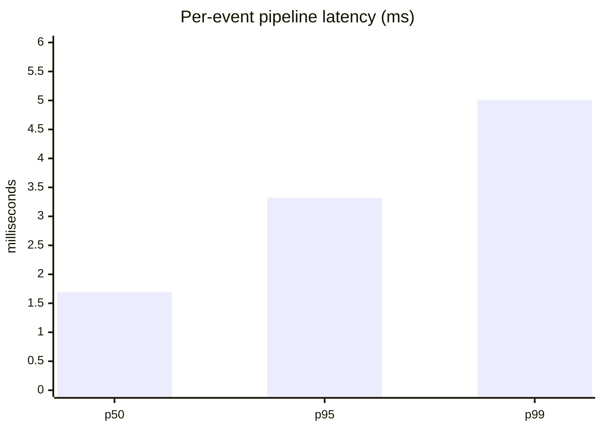

<div align="center">

# Elite Streambot

**Real-time alerts from Elite Dangerous to Streamer.bot.**

[](https://github.com/TannerMidd/elite-dangerous-streambot/actions/workflows/ci.yml)
[](https://github.com/TannerMidd/elite-dangerous-streambot/releases/latest)
[](LICENSE)
[](#quick-start)

[**📖 User Guide**](https://tannermidd.github.io/elite-dangerous-streambot/) · [**⬇️ Download**](https://github.com/TannerMidd/elite-dangerous-streambot/releases/latest)

</div>

---

Elite Streambot watches your Elite Dangerous journal as you play and fires Streamer.bot actions when things happen in the black — bounties, interdictions, deaths, first discoveries, low fuel, and more — with the live data baked in. Set it up once and leave it running; your alerts react to the game on their own.

```
Elite Dangerous  ─►  Elite Streambot  ─►  Streamer.bot  ─►  sounds · TTS · OBS · chat
  journal files       rules + values         your actions
```

## Features

- **Real-time journal watching** with startup replay — restart mid-session without losing your totals.
- **No-code rule builder** — create and edit alerts in the dashboard, or hand-edit YAML (hot-reloaded on save).
- **Sandboxed conditions** — rule files are safe to share; full JavaScript only via explicit opt-in.
- **Live session stats** for stateful alerts, like *every 10th jump* or *death #N this stream*.
- **Resilient Streamer.bot link** — auto-reconnect, an offline alert queue, and visible dispatch errors.
- **Global variable sync** — publishes live session and ship state (`%edSystem%`, `%edJumps%`, `%edLandingGearDown%`, …) into Streamer.bot's Global Variables for your own actions and commands to read.
- **Test without the game** — a built-in event simulator and per-rule test-fire.
- **Batteries included** — 10 preset rules and matching alert sounds.

## Quick start

1. Download and unzip the [latest release](https://github.com/TannerMidd/elite-dangerous-streambot/releases/latest), then run **`EliteStreambot.exe`**.
2. Open the dashboard at **http://localhost:8377**.
3. In Streamer.bot, start the WebSocket Server (**Servers/Clients → WebSocket Server**). The dashboard badge turns green when connected.

Full setup — creating actions, wiring sounds, and writing rules — is in the **[User Guide](https://tannermidd.github.io/elite-dangerous-streambot/)**.

## How it works

A rule maps a game event to a Streamer.bot action, passing live values through as `%variables%`:

```yaml
name: Big Bounty
trigger: Bounty
when: event.TotalReward >= 250000
action: ED Big Bounty
args:
  reward: "{{event.TotalReward | credits}}"   # %reward% → "425,000 CR"
```

The full rule reference — triggers, conditions, session values, and filters — lives in the [User Guide](https://tannermidd.github.io/elite-dangerous-streambot/#reference).

## Performance

Measured on the live process (Windows 11, Node 20) running the full pipeline against real gameplay:

| Metric | Value |
|---|---|
| Idle CPU (game running) | **0.73%** of one core |
| Idle memory | **~48 MB**, flat |
| Sustained throughput | **~450 events/sec** (gameplay peaks at a few/sec) |
| Pipeline latency | p50 **1.7 ms** · p95 **3.3 ms** · p99 **5.0 ms** |



Memory growth under load is V8 heap headroom, not accumulation — every server-side buffer is bounded, so long sessions plateau around 60–70 MB.

## Security

- **Sandboxed conditions** — shared rule files cannot execute code; full JavaScript requires an explicit per-rule `unsafe: true`, flagged in the dashboard.
- **Loopback only** — the dashboard binds to `127.0.0.1`, with DNS-rebinding protection.
- **Local by design** — nothing leaves your machine.

## Development

Requires [Node.js](https://nodejs.org) 18+.

```bash
npm install
npm run dev        # run from source
npm test           # unit tests (evaluator, templates, session, engine)
npm run package    # build the standalone Windows exe into release/
```

CI builds and tests on Ubuntu and Windows on every push.

<details>
<summary>Project structure</summary>

```
src/
  index.ts                 wires the pipeline: watcher → session → rules → dispatch
  journal/watcher.ts       journal tail + replay, Status.json flag transitions
  state/session.ts         session stat aggregation
  rules/engine.ts          rule loading, hot reload, evaluation, cooldowns
  rules/safe-eval.ts       sandboxed condition evaluator
  rules/template.ts        {{path | filter}} rendering
  dispatch/streamerbot.ts  WebSocket client: reconnect, outbox, response tracking
  server/index.ts          Express + WS: dashboard API, rule CRUD
public/                    dashboard (vanilla JS, no build step)
rules/                     preset rules (YAML)
docs/                      user guide (GitHub Pages)
```

</details>

## License

[MIT](LICENSE)

<div align="center"><sub>Not affiliated with Frontier Developments or Streamer.bot. Fly dangerous. o7</sub></div>
